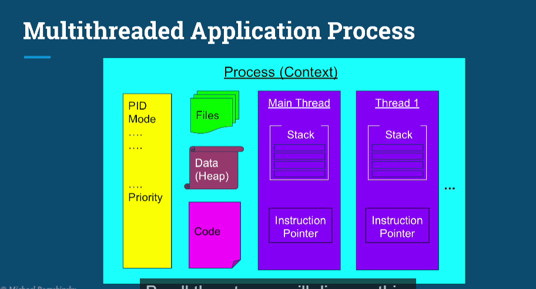

# This is the introducton section of the course having 2 lecs

L1 OS fundamentals part 1
L2 OS fundamentals part 2

## L1
Need of threads?
#### 1. Responsiveness
poor responsiveness - long waiting time
using single thread - waiting time is more
eg.  online web app processing requests
If only one thread then one request at a time and other's have to wait

Responsiveness is critical in applications with a UI
eg. movie player - tasks(video, audio, requests like mouse clicks etc.)
Can be achieved using multiple threads

By multitasking between different threads computer can create illusion as if all tasks are running simultaneously - This is called concurrency

NOTE: We don't need multiple cores to achieve concurrency

#### 2. performance
With multiple cores we can truly run tasks in parallel
performance impact of multithreading is completing complex tasks faster, finish more work in same time, same work using less machines

Caveat:
multithreaded programming is fundamentally different from  single threaded programming

#### OS fundamentals:
What threads actually are
Turn on computer -> special program called OS is loaded from disk to memory which provides an abstraction for us to interract with the hardware and CPU
All other applications such as browser, text editor reside on a disk in the form of a file just like a photo, document etc.
When we run the application the os takes the program of the application from the disk and creates and instance of the application in the memory
This instance is called as the **process** or *context of an application*


Each process is completely isolated from any other process

Other Things that the process contains are:
metadata - process ID
files for reading and writing
the code
the heap which holds the data
atleast one thread called the main thread which contains two main things **stack** and **instruction pointer**

***In multithreaded application each thread come with it's own stack and IP but all other components are shared***



In short the stack is a reagion in memory where local variables are stored and passed to functions
Inspruction pointer is the address of the next instruction to execute

## L2
Os fundamentals
#### 1. Context switch
Each instance of an app we run we have a different process for each
Usually we have more processes compared to cores where each process has more than one thread
Each of the threads is competing to execute on the CPU
So OS has to run one thread stop is then stop it and execute another

So stop t1 -> schedule t1 out -> schedule t2 in -> start t2
The above act is called as context switching

context switching is not cheap and is the price of multitasking(concurrency)

Each thread consumes some reources in the CPU like registers, cache and memory like kernal resources
When we switch to a different thread we need to store all this data and restore the resources of a different thread back to CPU and memory

So having too many threads causes ***Thrashing*** meaning the OS spends more time siwtching btw threads than running our tasks

Threads consume less resources compared than processes as threads from the same process share some of the things (metadata, files, code, heap etc.)

So context switching btw threads from the same process is cheaper compared to context switch btw threads of different processes

#### 2. How OS manages Thread scheduling
How OS decided when to run which thread aand when to perform a context switch

How Os decides which thread to run first?
Policies:
1. FCFS - if very long thread first the starvation of other threads 
2. SJF - starvation of longer threads if shorter jobs arrival rate is high
3. Actual - 
- OS divides time interval in moderately sized epochs
- In each epoch the OS allocates different time slice for each thread
- Not all threads get to run in each epoch

Decision of allocation of thread to resources based on ***Dynamic Proirity***

```c#
Dynamic Priority = Static Priority + Bonus
bonus can be negative
```

Static priority set by developer ahead of time
Bonus adjusted by OS in every epoch for each thread

This way OS will give priority to interactive and give preference to computational threads which did not complete in the last epochs to prevent starvation

Each OS has it's own scheduling algorithm

#### 3. When to use Thread vs Processes 

When to use multiple threads in a single program and when to simply create a new program and run it in a different proccess

Use the image of a process as mental model
So for multiple process we will have multiple images 

##### When to prefer multi threaded architecture
Threads share a lot of resources, so if tasks share a lot of data  prefer threads
Threads are faster to create and destroy
Switching btw threads of same processes is faster

##### When to prefer multi process architecture 
Security and stability are of higher priority (as seperate process are completely isolated from each other)
-- *As one thread in a multi threaded application can bring down and entire app*

Also when the tasks are unrelated to each other